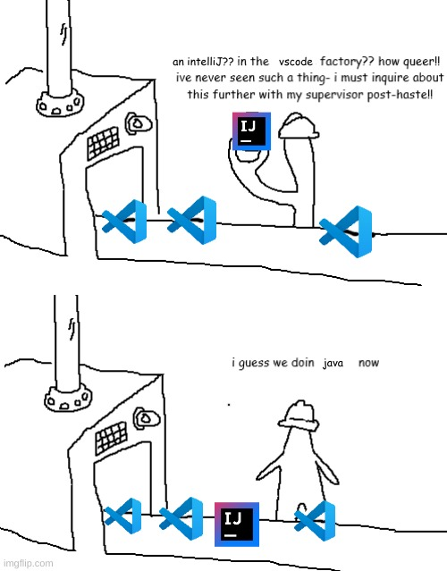

<!--<h6>What am i listening to?</h6>-->

I am a Programmer X Cybersecurity enthusiast that loves to learn new things. i am always trying to do something, you can contact me at "hydrophobis" on discord if you have any questions or just want to know what im doing for my current project! 

<link rel="stylesheet" href="styles.css">

  <!---->
  

<h1>My languages:</h1>
    

        
    

     
    <h2>Applications and Software:</h2>
    

        
    

     
    <h2>Operating Systems:</h2>
    

        
    

     
    <h2>Socials:</h2>
    

        
        <h6>Contact my discord if you want my email for any purposes</h6>
    

 

<h2>Red-teaming/pentesting tools I excel with:</h2>

 

 

<h2>Miscellaneous Info:</h2>

    
    
    

<!---
CamoGekko/CamoGekko is a ✨ special ✨ repository because its `README.md` (this file) appears on your GitHub profile.
You can click the Preview link to take a look at your changes.
--->
