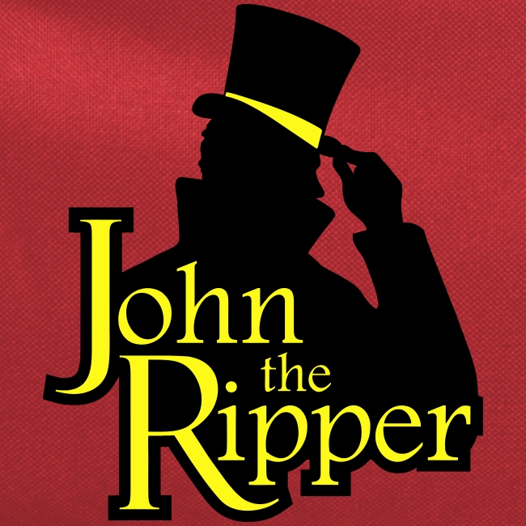

I am a Programmer X Cybersecurity enthusiast that loves to learn new things. i am always trying to do something, you can contact me at "someonestoleriver" on discord if you have any questions or just want to know what im doing for my current project!
### Languages:
| C++ | ⠀C ⠀| HTML |
|-----|---|------|
||||
### Not extremely skilled in:
| JavaScript | Python3 | Bash | Batch | ⠀C#⠀|
|-|-|-|-|-|
||||||

  

### Red-teaming/pentesting tools I excel with:
| ⠀NMAP⠀ | MetaSploit | JohnTheRipper | ⠀Hydra⠀ | WireShark | GoBuster | ⠀SQLMap⠀ |
|-|-|-|-|-|-|-|
||||||||

    
    
    

<!---
CamoGekko/CamoGekko is a ✨ special ✨ repository because its `README.md` (this file) appears on your GitHub profile.
You can click the Preview link to take a look at your changes.
--->
